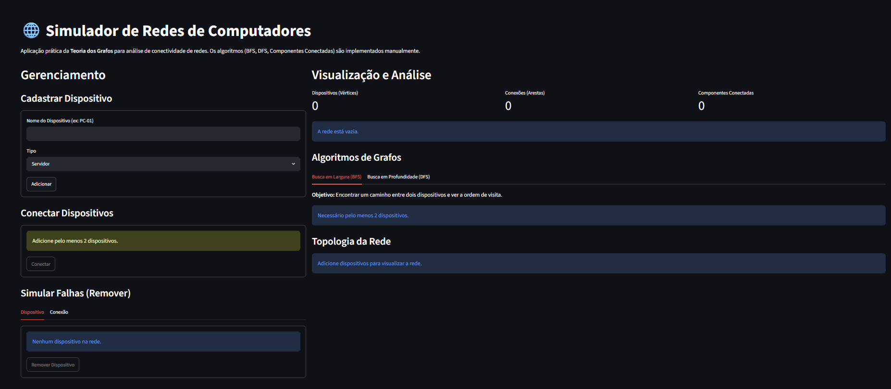
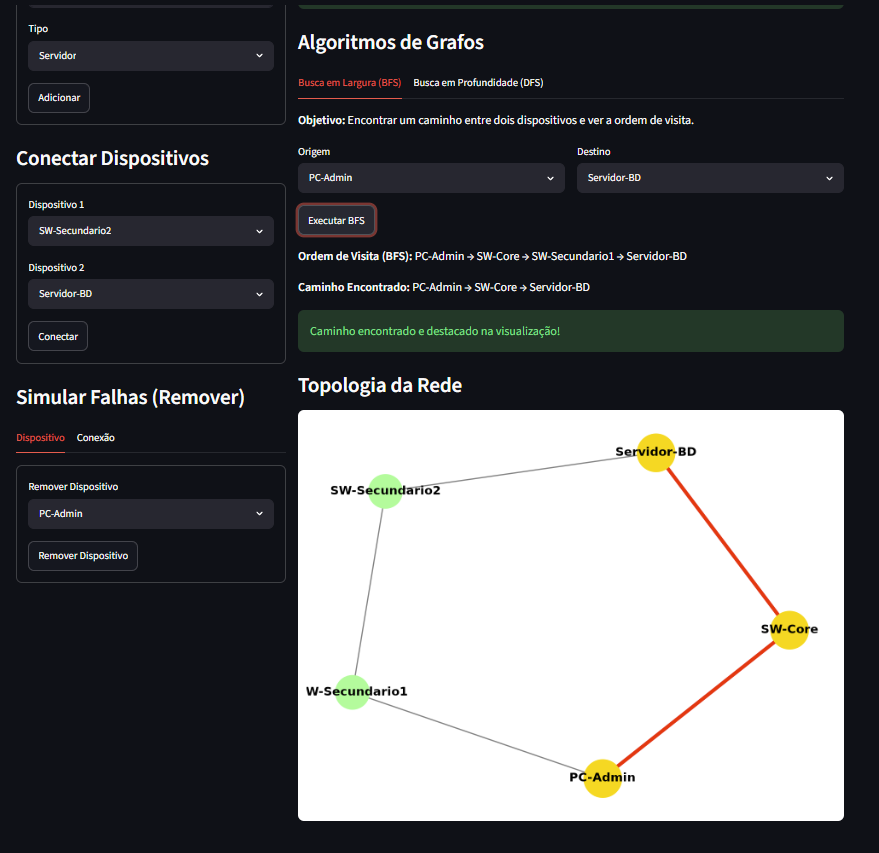
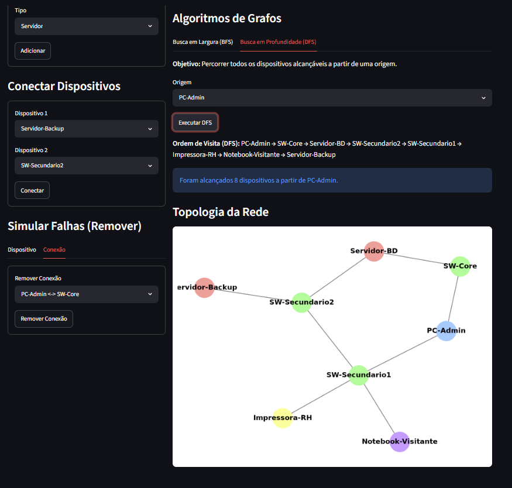

# G11_Grafos-EDA2-2026.1# Simulador de Redes - Teoria dos Grafos

**Número da Lista:** 11  
**Disciplina:** Estruturas de Dados II

## Alunos

| Matrícula | Aluno |
|-----------|--------|
| [211031403] | [Marcus Vinicius Cunha Dantas] |
| [Matrícula do Colega] | [Nome do Colega] |

## Sobre

Sistema desenvolvido em **Python** utilizando a biblioteca **Streamlit** para simular e analisar a topologia e a conectividade de redes de computadores. O projeto aplica a **Teoria dos Grafos** na prática, implementando os algoritmos clássicos de busca de forma manual.

O projeto representa a rede de computadores como um grafo não direcionado e não ponderado, onde cada dispositivo (Servidor, Roteador, Switch, PC, etc.) é um vértice e cada cabo de conexão é uma aresta. A estrutura principal do grafo é mantida através de uma Lista de Adjacência.

Os principais objetivos da aplicação são:
- Encontrar o caminho mais curto entre dois equipamentos na rede.
- Mapear a topologia completa a partir de um nó específico.
- Simular falhas (queda de roteadores/switches) e identificar se a rede foi dividida em partes isoladas.
---

## Estrutura do Projeto
```
├── app.py              # Interface visual (Streamlit)
├── graph.py            # Algoritmos (BFS, DFS) e lógica
├── requirements.txt    # Dependências do projeto
└── README.md           # Documentação
```
---

## Screenshots

*(Adicione os prints do seu projeto e substitua os nomes dos arquivos abaixo)*

Tela inicial do simulador com a rede montada


Visualização da rede e execução da Busca em Largura (BFS)


Mapeamento de topologia usando Busca em Profundidade (DFS)


---

## Instalação

### Pré-requisitos

- Python 3.x
- Pip (Gerenciador de pacotes do Python)

### Execução

No diretório raiz do projeto, instale as dependências necessárias listadas no `requirements.txt`:

```bash
pip install -r requirements.txt